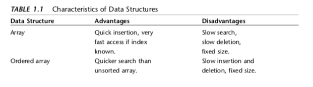
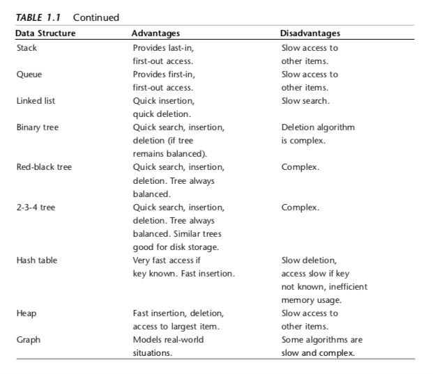

I am reading "Data Structure and Algorithm in Java" by Robert Lafore. I was reading another book with C++ before but honestly I don't feel comfortable and don't feel it's practical to learn data structure in C++ as a self-taught, because I will mainly only learn either Java or C++ for technical interview, so why use C++ when you can just use Java for easiness?

Let the journey of learning begin!

PS: This project's purpose is mainly to document my learning experience of data structure, and hopefully by having the project and document it it will motivate me to stick it to the end. Cheers!

---
Some useful stuff

---

Array:
Insert: 1 step

Search: N, average N/2

Delete: Search and move the rest of the array
