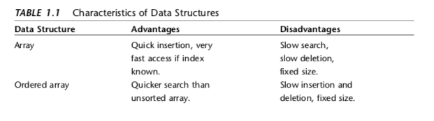
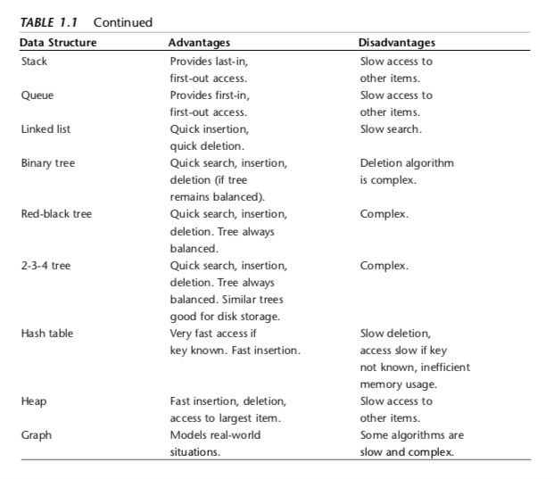

I am revisiting Data Structure by reading "Data Structure and Algorithm in Java" by Robert Lafore. I was reading another book with C++ before but honestly I don't feel comfortable and don't feel it's practical to learn data structure in C++ as a self-taught, because I will mainly only learn either Java or C++ for technical interview, so why use C++ when you can just use Java for easiness?

Let the journey of learning begin!

PS: This project's purpose is mainly to document my learning experience of data structure, and hopefully by having the project and document it it will motivate me to stick it to the end. Cheers!

Edit:5/24/2019:     
Here are the advantages of taking notes on github, that I realized after 4 months into this:    
1. The code is colorized
2. You can check previous code conveniently because it's stored and organized
3. You can copy and paste code from the textbook easily instead of spend eternity writing them down on a paper
4. The note can be viewed anywhere
5. The formating of writing on github is a lot easier, compared to try to organize it with paper
6. Remembering where you have read to is a lot easier
7. Documents are better organized

Here are the advantages of reading it in actual code, compared to just reading pseudocode and try to write it yourself: (aka why I read this book)    
1. You have something concrete to remember, instead of just remembering the process of the pseudocode
2. One thing that I was very curious is about different implementation of the same code, pseudocode can't be compared. It's not concrete
3. You don't need to waste time figuring out the actual code from pseudocode. 

---
Some useful stuff

---Done Chapter 1

Array:
Insert: 1 step    
Search: N, average N/2    
Delete: Search and move the rest of the array    

* * *

A bit of digression:

I am curious about 3D in Java suddenly. And discover and figure out this.

* * *

### Chapter 3 Sort

(**Tips: when thinking about 2d array, thinking of it as when outter array is 0, inner array goes from 0 to n** no from the big picture, it wouldnt make sense that way)

Start of the construction of my review question:
[Review Question](./review_questions)

selectsort and bubblesort are all O(N^2), but selectsort is faster.

insertion sort algorithm visualization:

Insertion sort logic:
In the outer for loop, out starts at 1 and moves right. It marks the leftmost unsorted data. In the inner while loop, in starts at out and moves left, until either temp is smaller than the array element there, or it can’t go left any further. Each pass through the while loop shifts another sorted element one space right.

How many comparisons and copies does this algorithm require? On the first pass, it compares a maximum of one item. On the second pass, it’s a maximum of two items, and so on, up to a maximum of N-1 comparisons on the last pass. This is
1 + 2 + 3 + ... + N-1 = N*(N-1)/2
However, because on each pass an average of only half of the maximum number of items are actually compared before the insertion point is found, we can divide by 2, which gives
N*(N-1)/4

For data that is already sorted or almost sorted, the insertion sort does much better. When data is in order, the condition in the while loop is never true, so it becomes a simple statement in the outer loop, which executes N-1 times. In this case the algo- rithm runs in O(N) time. If the data is almost sorted, insertion sort runs in almost O(N) time, which makes it a simple and efficient way to order a file that is only slightly out of order.

However, for data arranged in inverse sorted order, every possible comparison and shift is carried out, so the insertion sort runs no faster than the bubble sort.

Stability:
Some sorting algorithms retain this secondary ordering; they’re said to be stable.

All the algorithms in this chapter are stable. For example, notice the output of the objectSort.java program (Listing 3.4). Three persons have the last name of Smith. Initially, the order is Doc Smith, Lorraine Smith, and Paul Smith. After the sort, this ordering is preserved, despite the fact that the various Smith objects have been moved to new locations.

Comparing the sorts
The selection sort minimizes the number of swaps, but the number of comparisons is still high. This sort might be useful when the amount of data is small and swapping data items is very time-consuming compared with comparing them.

**MY: selection sort is picking the position, and put the right item at that position. insertion sort is getting the next item, and put it at the left pile while maintaining its sortedness on the left pile**

# Chapter 4

Stack and queue enforces restricted access

<a href="workable/stack.java" 
target="_ blank">Stack Implementation</a>

//skip reversing a word using stack, it's just breaking down a string with charAt and push it into a stack and pop it then cancat it to an empty string

<a href="workable/brackets.java" 
target="_ blank">Delimiter matching</a>

Efficiency of stack: pop and push are both O(1)

* * *

About circular queue: a way to make the front and the back moves forward so the back doesn't need to reach the end of the array

(A little bit of hiccup here. The markdown on atom.io turns everything after an underscore to purple. And then digress to other things. After three months since December last year, now get back to it)

(Also, I feel like self-teaching CS and reading a 800pages e-book require some sort of keep-tracking. And a note/review/sharing place on github fits the bill for this purpose very well).
(The reason for it is because you need to try to execute the code to learn CS, just reading about it is too abstract(at least for me). )

Insert is called add/put/enque, remove is called delete/get/deque
The rear of the queue is inserted is also called back/tail/end, the head is also called front.
The rear is the beginning of the array, and the head is the end of the array

<a href="workable/queue.java" 
target="_ blank">Queue Array Implementation</a>

(One more thing about just reading it on textbook, is the code doesn't have color and its hard to read)
(One more thing is having it online allows you to saving time when redoing it with your own version)

(2 months has passed. I am coming back from a digression of reading the queue implementation. Just can't figure out why rear has to equal to -1 and can't be 0, and if I can make it to become 0)

### Try to solve Queue Implementation 
So there are two problems I have, 1. why rear is -1 and front is 0, 2. why rear is on the left and front is on the right of the array.

Third question, there are many kinds of implementation of Queue, which one is correct, which use should I use? Which one should I write it into my notes

To answer this question, I need to figure out one of them, and implement it correctly and then write down the code, which is the hardest part, because I can't break down the construction of implementation process.

<a href="https://www.youtube.com/watch?v=okr-XE8yTO8" 
target="_ blank">[mycodeschool]Queue explaination by someone which rear and front are -1, which is more understandable</a>

By the explaination is too fast, I kind of understand the pseudo code, but not totally, still very vague

Tried looking up to google, the text format is too hard to distill.

<a href="https://www.geeksforgeeks.org/circular-queue-set-1-introduction-array-implementation/" 
target="_ blank">[circular queue webpage geekforgeek]Another circular queue implementation that has rear and front equals to -1.</a>

<a href="https://www.youtube.com/watch?v=wjI1WNcIntg" 
target="_ blank">Queue in Linked List</a>

<a href="https://www.youtube.com/watch?v=gnYM_G1ILm0" 
target="_ blank">[some random youtuber]Another queue implementation that has rear on the right</a>

<a href="https://www.youtube.com/watch?v=q5oOYxfOD1c" 
target="_ blank">[geekforgeek video]Another queue implementation that has rear equals to capacity - 1</a>

So the implementation in this book is largely simplify.    
The implementation doesn't do error checking like checking if full for insert

So here I have to make a choice here. Whether to use the simply queue implementation in the book, or use the one on GeekforGeek

To figure out which to use, I have to completely understand the implementation of the book's and of the GeekForGeek's and then compare it.

To better do that, just reading it and taking mental note is not enough. I need to write down the explanation of both.

For the book's, front=0; rear=-1; insert: when rear is at the end of the array, make it -1, don't worry, we will add it at the end anyways.

The remove increment the front, and then check wrapping

Ok, I find a line saying this implementation assumes the queue is not full. This is *important*

For GeekForGeek,front and rear=-1; it has a full check, and a first element check to both front and rear to 0; *okay, the book's implementation is more elegant but more complex, because it combines the first element check and other condition*.

It also has a front!=0 check for the wrap around condition, why? One obvious reason is it's a check for full condition.  The book's implementation doesn't have it because it has an assumption. One lesson learn: *assumption can be major*.

For the remove/dequeue, do an empty check,

One difference between front=0 vs =1 is the other functions.

I actually really want to just forget the implementation from the book, and just write down the implementation from geekforgeek and mycodeschool

I need a bigger screen to write the implementation, or even better double screen. I can use my ipad to read, I can download the book to ipad and read it there. Or I can just do it with a laptop

Okay I was writing the circular implementation from geekForgeek, this (rear==(front-1)%(size-1))) is confusing me.

When enqueue, front doesn't wrap around if front is bigger than the array size.

(A few minutes later)

Oh crap, front doesn't move with enqueue, it wraps around at dequeue, my bad

Okay, successfully implement based on GeekForGeek. Its at queue2.java

**Lesson Learned**: where there is slightly more complicate math, like (rear==(front-1)%(size-1))), make example...(but maybe writing it on the code is not such a good idea but it makes the code messier, I wish I can attach a sticky note to the code, but because its coding it must be a document, but having the property of a adherent feature is difficult. I have to be creative to solve this problem, or I just deal with it as it is. 
	
If its on paper, I will have it on a draft paper, but I also want to keep the notes. What do I do? 

Because of this, computer science note is destined to be messy.

Or I should not keep the notes.

Whats the goal? Keep my calculation, and be reminded of how I solve this problem. Because of this, I can have a "Tips and Tricks section")

I think its a good idea. Is there a better idea?

What would be the format of Tips and Tricks. Reference of page, calculation and notes, and lesson learned.
* * *

Whats next? Keep reading? Constructing Tips and Tricks? Dive deeper into Queue and combine the function from the book and from geekforgeek? Write more implementation from mycodeschool? but mycodeschool is not circular.

Just check another implementation.     
The way geekforgeek do it seems to be the standard.

Now another question, there are some many ways to implement a data structure, how do I make peace of it.

Just remember one? Learn the pseudo code?

Anyways, what makes them different?

I want to compare all of them and figure out their code structure and figure out what makes them different.    
But its very time consuming     
In the term of Myers-briggs, it is my Ni trying to figure out the why, for sure I can't use Si to remember them, but if I know the pseudo code, and able to implement it, then I pass the test.
Si to remember the pseudo code.    
yeah, what exactly is the pseudo code for queue, maybe I will have another text file for pseudo code

Looking back, just figuring out Queue implementation took 2 months from March to May, luckily I can do it in my own pace by self-studying

### Deques 
("we won't explore it further here")

### Priority Queue
like an ordinary queue, a priority queue has a front and a rear; however, in a priority queue, items are ordered by key value so that the item with the lowest key is always at the front. Items are inserted in the proper position to maintain the order

(Priority queue will be used in finding something called a minimum spanning tree for a graph in Chapter 14, "weighted graphs")

(In a preemptive multitasking operating system, for example, program may be placed in a priority queue so the highest priority program is the next one to receive a time-slice that allows it to execute)

You also awnt a priority queue to provide fairly quick insertion. Because of that, priority queue is often implemented witha data structure called a heap.

In this chapter, we will implement

(Okay, in this book, the front is at nElement-1, and not at index 0, which is different from other common implementations)

so what to do here..I can jog down this implementation, and then explore the common implementation, and then figure out the difference. Yes, this is the high way to go.

Jog down this implementation done, the implementation is largely different, the rear is at the beginning of the array and the rear is at the right, enqueue is on the left O(n) and delete is on the right.

But isn't normally the enqueue is on the right?

** The real problem is, there is no front and rear pointer**

Also, this implementation doesn't check if array is full 

### Parsing arithmetic Expression
for example: 2*(3+4) or ((2+4)*7)+3*(9–5)

It's easier for the algorithm to use a two-step process: 
1. Transform the arithmetic expression into a different format, called postfix notation
2. Evaluate the postfix expression

#### Postfix Notation
2+2 and 4/7 is called infix notation

In postfix notation , the operator follows the two operands. Thus A+B becomes AB+, a/b becomes AB/. More complex infix expressions can likewise be translated into postfix notation

A+B–C   AB+C–      
A*B/C   AB*C/     
A+B*C   ABC*+     
A*B+C   AB*C+     
A*(B+C)   ABC+*     
A*B+C*D   AB*CD*+     
(A+B)*(C–D)   AB+CD–*     
((A+B)*C)–D   AB+C*D–     
A+B*(C–D/(E+F))   ABCDEF+/–*+     

PS: this parsing algorithm only works for single digit numbers, although these expressions may evaluate to multidigit numbers

I just make the infix to postfix parse working, but how it works is still unclear. Anyways, I will try to figure it out later, with figuring out chapter 3.

Just make the postFix evaluation working too, but how it works is unclear, or should I say, the pseudocode of making it work is unclear.

Nice, chapter 5 now 

### Chapter 5, Linked Lists

In chapter 2, "array", we saw we saw that arrays had certain disadvantages as data storage structures. In an unordered array, searching is slow, whereas in an ordered array, insertion is slow. In both kinds of arrays, deletion is slow. Also, the size of an array can’t be changed after it’s created.

In this chapter we will look at a data storage structure that solves some of these problems: the *linked list*.

Most of the time you can use a linked list in many cases in which you use an array, unless you need frequent random access to individual item using an index

Link (MY: aka node):

		class Link
		{
		public int iData; // data
		public double dData; // data
		public Link next; // reference to next link
		}

### Reference and Basic Types
Being able to put a field of type Link inside the class definition of this same type may seem odd. Wouldn’t the compiler be confused? How can it figure out how big to make a Link object if a link contains a link and the compiler doesn’t already know how big a Link object is?

The answer is that in Java a Link object doesn’t really contain another Link object, although it may look like it does. The next field of type Link is only a reference to another link, not an object.

Note that in Java, primitive types such as int and double are stored quite differently than objects. Fields containing primitive types do not contain references, but actual numerical values like 7 or 3.14159.

A primitive type creates a space in memory and puts the number 65000.00 into this space. However, a reference to an object like

		Link aLink = someLink;

puts a reference to an object of type Link, called someLink, into aLink. The someLink object itself is located elsewhere. It isn’t moved, or even created, by this statement; it must have been created before. To create an object, you must always use new:

		Link someLink = new Link();

Other languages, such as C++, handle objects quite differently than Java. In C++ a field like

		Link next;
		
actually contains an object of type Link. You can’t write a self-referential class definition in C++ (although you can put a pointer to a Link in class Link; a pointer is similar to a reference). C++ programmers should keep in mind how Java handles objects; this usage may be counter-intuitive.	

		class LinkList
		{
		private Link first; // ref to first link on list
		// -------------------------------------------------------------
		public void LinkList() // constructor
		{
		first = null; // no items on list yet
		}
		// -------------------------------------------------------------
		public boolean isEmpty() // true if list is empty
		{
		return (first==null);
		}
		// -------------------------------------------------------------
		// ... other methods go here
		}

**IMPORTANT**:

		public void insertFirst(int id, double dd)
		{ // make new link
			Link newLink = new Link(id, dd);
			newLink.next = first; // newLink --> old first
			first = newLink; // first --> newLink
		}
		
the new node's next point to the first, and first points to new pointer... This is a mess.

MY:Okay, when the first is on the right, it is the object; when its on the left, it is the reference, Let's think of it this way. This might be the key point I have been missing.

Lets think deeper. What if head is the object. then the third statement will not make sense.    
What if head is just the reference. Then new_node.next will point to what head points to, and first is also pointing to newLink. This can make sense too. So which one is the right one.

One thing to notice is head is a pointer that doesn't have a next reference. Head is just a reference. so newLink.next = first; actually is just the new node pointing what the first/head is referencing. And first = newLink; is the reference, which doesn't change address, pointing to the object of the new node.

###### The deleteFirst method 
This method is the reverse of insertFirst(). It disconnects the first link by rerouting first to point to the second link.

		public Link deleteFirst() // delete first item
		{                         // (assumes list not empty)
			Link temp = first; // save reference to link
			first = first.next; // delete it: first-->old next
			return temp; // return deleted link
		}
temp is the reference of the object of where first points to. first reference now points to the next which belongs to where the first points to.

Notice that the deleteFirst() method assumes the list is not empty. Before calling it, your program should verify this fact with the isEmpty() method.

###### The displayList() Method
To display the list, you start at first and follow the chain of references from link to link. A variable current points to (or technically refers to) each link in turn. It starts off pointing to first, which holds a reference to the first link. The statement

		current = current.next;
		
changes current to point to the next link because that’s what’s in the next field in each link. Here’s the entire displayList() method:

		public void displayList()
		{
			System.out.print(“List (first-->last): “);
			Link current = first; // start at beginning of list
			while(current != null) // until end of list,
			{
				current.displayLink(); // print data
				current = current.next; // move to next link
			}
			System.out.println(“”);
		}

###### Finding and Deleting Specific Links

This is the find code

		public Link find(int key) // find link with given key
		{ // (assumes non-empty list)
			Link current = first; // start at 'first'
			while(current.iData != key) // while no match,
			{
				if(current.next == null) // if end of list,
					return null; // didn’t find it
				else // not end of list,
					current = current.next; // go to next link
			}
			return current; // found it
		}
		
MY: One question I have is, why here it it has a if current.next==null check but displayList doesn't have it..? in find() it can stop before checking the null pointer which is also the tail. so it won't evaluate current.iData. I will change it around to give it a check to see if it will throw an error.

Result: yes, it will throw a nullPointerException    
Because I am doing null.iData, which will throw error

And delete makes sense too. I just need a way to remember insertFirst,deleteFirst,find, and delete

### Double-End Lists
Everything is the same as regular linklist except: a reference to the last link as well as to the first

Access to the end of the list as well as the beginning makes the double-ended list suitable for certain situations that a single-ended list can’t handle efficiently. One such situation is implementing a queue

		public void insertFirst(long dd) // insert at front of list
		{
		    Link newLink = new Link(dd); // make new link
		    if( isEmpty() ) // if empty list,
		        last = newLink; // newLink <-- last
		    newLink.next = first; // newLink --> old first
		    first = newLink; // first --> newLink
		}
		
Why last =newlink??? Oh, it's when it's empty, then last will point to the first element that's entered, which is the last.

		public void insertLast(long dd) // insert at end of list
		{
		    Link newLink = new Link(dd); // make new link
		    if( isEmpty() ) // if empty list,
		        first = newLink; // first --> newLink
		    else
		        last.next = newLink; // old last --> newLink
		    last = newLink; // newLink <-- last
		}

when its empty, first and last point to the new node, if its not empty, last will point to new link and the previous will point to the new link.

		public long deleteFirst() // delete first link
		{ // (assumes non-empty list)
		long temp = first.dData;
		if(first.next == null) // if only one item

		    last = null; // null <-- last
		first = first.next; // first --> old next
		return temp;
		}

when its the last element, last=null;

Unfortunately, deleteing the last node won't be an option because there is still no reference to the next to last node, whose next field would need to be changed to null if the last node were deleted. To achieve that, you need doubly linkedlist

### Time Efficiency
Insertion and deletion is O(1)    
Finding, deleting or inserting next to a specific item are O(N). An array is also O(N) for these operations, but the linked list is nevertheless faster because nothing needs to be moved when an item is inserted or deleted. The increased efficiency can be significant, epecially if a copy takes much longer than a comparison.

### Abstract Data types
In array implementation of stack, push and pop are as:

	arr[++top]=data;
	data=arr[top--];

In linklist implementation of stack, it is:

	theList.insertFirst(data)
	data = theList.deleteFirst()

### ADT List
You can insert an item, delete an item, and usually read an item from a specific location (the third item, say).

Don't confuse the ADT list with the linked list. A list is defined by its interface: the specific methods used to interact with it. This interface can be implemented by various structures, including arrays and linked lists. The list is an abstraction of such data structures.

### Sorted List 
In general you can use a sorted list in most situations in which you use a sorted array. The advantages of a sorted list over a sorted array are speed of insertion (because elements don’t need to be moved) and the fact that a list can expand to fill available memory, while an array is limited to a fixed size. However, a sorted list is somewhat more difficult to implement than a sorted array

A sorted list can also be used to implement a priority queue, although a heap is a more common implementation.

		public void insert(long key) // insert in order
		{
			Link newLink = new Link(key); // make new link
			Link previous = null; // start at first
			Link current = first;
			// until end of list,
			while(current != null && key > current.dData)
			{ // or key > current,
				previous = current;
				current = current.next; // go to next item
			}
			if(previous==null) // at beginning of list
				first = newLink; // first --> newLink
			else // not at beginning
				previous.next = newLink; // old prev --> newLink
			newLink.next = current; // newLink --> old current
		} // end insert()
		
Okay, I checked the implementation of a simple linked list, the implementation is again a little bit different. It uses previous here and a simple linked list use first in its insertFirst.

### List Insertion Sort 
Imagine you put an unsorted array into a sorted linklist, and then put it back to the array. This turns out to be substantially more efficient than the more usual insertion sort within an array. 

However, each item is copied only twice: once from the array to the list and once from the list to the array. N*2 copies compares favorably with the insertion sort within an array, where there are about N^2 copies.

The drawback of it is it takes twice the memory.

### Doubly Linked lists

		class Link
		{
		public long dData; // data item
		public Link next; // next link in list
		public link previous; // previous link in list
		...
		}
		
The upside is you can traverse backward, the downside is every time you insert or delete a link you must deal with four links instead of two: two attachments to the previous link and two attachments to the following one.

Traverse backward:

		Link current = last; // start at end
		while(current != null) // until start of list,
		current = current.previous; // move to previous link

### Insertion 
There are insertFirst(), insertLast(), and insertAfter() now

Unless the list is empty, the insertFirst() routine changes the previous field in the old first link to point to the new link and changes the next field in the new link to point to the old first link. Finally, it sets first to point to the new link. 

If the list is empty, the last field must be changed instead of the first.previous field.

		if( isEmpty() ) // if empty list,
		last = newLink; // newLink <-- last
		else
		first.previous = newLink; // newLink <-- old first
		newLink.next = first; // newLink --> old first
		first = newLink; // first --> newLink

The insertLast() method is the same process applied to the end of the list; it’s a mirror image of insertFirst().

First, the link with the specified key value must be found. This procedure is handled the same way as the find() routine in the linkList2.java program (Listing 5.2). Then, assuming we’re not at the end of the list, two connections must be made between the new link and the next link, and two more between current and the new link.

If the new link will be inserted at the end of the list, its next field must point to null, and last must point to the new link. 

		if(current==last) // if last link,
		{
		newLink.next = null; // newLink --> null
		last = newLink; // newLink <-- last
		}
		else // not last link,
		{
		newLink.next = current.next; // newLink --> old next
		// newLink <-- old next
		current.next.previous = newLink;
		}
		newLink.previous = current; // old current <-- newLink
		current.next = newLink; // old current --> newLink
		
There got to be some way to remember it, maybe coding it myself once will be a good idea? I will write the question in the review question page.

		current.next.previous
		
means the previous field of the link referred to by the next field in the link current.

### Deletion
There are three deletion routines: deleteFirst(), deleteLast(), and deleteKey()

Assuming the link to be deleted is neither the first nor the last one in the list, the next field of current.previous (the link before the one being deleted) is set to point to current.next (the link following the one being deleted), and the previous field of current.next is set to point to current.previous. 

MY: Again, I need some way to remember it

		if(current==first) // first item?
		first = current.next; // first --> old next
		else // not first
		// old previous --> old next
		current.previous.next = current.next;
		if(current==last) // last item?
		last = current.previous; // old previous <-- last
		else // not last
		// old previous <-- old next
		current.next.previous = current.previous;
		
[The implementation](./workable/DoublyLinked.java)

The deletion methods and the insertAfter() method assume that the list isn’t empty

### Doubly Linked List as Basis for Deques
A doubly linked list can be used as the basis for a deque, mentioned in the preceding chapter. In a deque you can insert and delete at either end, and the doubly linked list provides this capability.

### Iterator
A data structure that allows you step from link to link    
A reference called current that is incremented to move to the next link    
However, how many references are needed. There really isn't an answer. Thus, it seems easier to allow the user to create as many such references as necessary.    
To make this possible in an object-oriented language, it's natural to embed each reference in a class object. This object can't be the same as the list class because there;s only one list object, so it is normally implemented as a separate class

To use such an iterator, the user might create a list and then create an iterator object associated with the list. Actually, as it turns out, letting the list create the iterator is easier, so it can pass the iterator certain information, such as a reference to its first field. 

		public static void main(...)
		{
		LinkList theList = new LinkList(); // make list
		ListIterator iter1 = theList.getIterator(); // make iter
		Link aLink = iter1.getCurrent(); // access link at iterator
		iter1.nextLink(); // move iter to next link
		}
		
The iterator always points to some link in the list. It’s associated with the list, but it’s not the same as the list or the same as a link. 

### Additional Iterator Features
We’ve seen several programs in which the use of a previous field made performing certain operations simpler, such as deleting a link from an arbitrary location. Such a field is also useful in an iterator.

Also, it may be that the iterator will need to change the value of the list’s first field—for instance, if an item is inserted or deleted at the beginning of the list. If the iterator is an object of a separate class, how can it access a private field, such as first, in the list? One solution is for the list to pass a reference from itself to the iterator when it creates the iterator. This reference is stored in a field in the iterator. The list must then provide public methods that allow the iterator to change first. These LinkList methods are getFirst() and setFirst(). (The weakness of this approach is that these methods allow anyone to change first, which introduces an element of risk.)

		class ListIterator()
		{
		private Link current; // reference to current link
		private Link previous; // reference to previous link
		private LinkList ourList; // reference to “parent” list
		public void reset() // set to start of list
		{
		current = ourList.getFirst(); // current --> first
		previous = null; // previous --> null
		}
		public void nextLink() // go to next link
		{
		previous = current; // set previous to this
		current = current.next; // set this to next
		}
		...
		}
		
The nextLink need to be looked into a little more closely in the future

### Iterator Methods
All operations previously performed by the class that involve iterating through the list, such as insertAfter(), are more naturally performed by the iterator.

List of methods:
* reset() -- Sets the iterator the start of the list 
* nextLink()--move the iterator the next link 
* getCurrent()--returns the link at the iterator
* atEnd-- Return true if the iterator is at the end of the list
* insertAfter()
* insertBefore()
* deleteCurrent()

Deciding which tasks should be carried out by an iterator and which by the list itself
is not always easy. An insertBefore() method works best in the iterator, but an
insertFirst() routine that always inserts at the beginning of the list might be more
appropriate in the list class. We’ve kept a displayList() routine in the list, but this operation could also be handled with getCurrent() and nextLink() calls to the iterator.

[iterator implementation](./workable/interIterator.java)

MY: how linklist encapsulate iterator is interesting too. It has a function that return a new iterator that accepts a parameter of a linked list object, replaced with this keyword.

When you delete an item with deleteCurrent(), should the iterator end up pointing
to the next item, to the previous item, or back at the beginning of the list? Keeping
the iterator in the vicinity of the deleted item is convenient because the chances are
the class user will be carrying out other operations there. However, you can’t move it
to the previous item because there’s no way to reset the list’s previous field to the
previous item. (You would need a doubly linked list for that task.) Our solution is to
move the iterator to the link following the deleted link. If we’ve just deleted the item at the end of the list, the iterator is set to the beginning of the list.

Traverse a list

		iter1.reset(); // start at first
		long value = iter1.getCurrent().dData; // display link
		System.out.println(value + “ “);
		while( !iter1.atEnd() ) // until end,
		{
		iter1.nextLink(); // go to next link,
		long value = iter1.getCurrent().dData; // display it
		System.out.println(value + “ “);
		}

Sample Code:

	class InterIterApp
	{
	public static void main(String[] args) throws IOException
	{
	LinkList theList = new LinkList(); // new list
	ListIterator iter1 = theList.getIterator(); // new iter
	iter1.insertAfter(21); // insert links
	iter1.insertAfter(40);
	iter1.insertAfter(30);
	iter1.insertAfter(7);
	iter1.insertAfter(45);
	theList.displayList(); // display list
	iter1.reset(); // start at first link
	Link aLink = iter1.getCurrent(); // get it
	if(aLink.dData % 3 == 0) // if divisible by 3,
	iter1.deleteCurrent(); // delete it
	while( !iter1.atEnd() ) // until end of list,
	{
		iter1.nextLink(); // go to next link
	aLink = iter1.getCurrent(); // get link
	if(aLink.dData % 3 == 0) // if divisible by 3,
	iter1.deleteCurrent(); // delete it
	}
	theList.displayList(); // display list
	} // end main()
	} // end class InterIterApp

Other methods like **find()** and **replace()**. This is up for exercise

## 6. Recursion

Intuitive way of coming out the solution of triangular number:    
1.First, think of it as combination of 2 components. In this case, n and the sum of the remaining column.

		int triangle(int n)
		{
		return( n + sumRemainingColumns(n) ); // (incomplete version)
		}
		
however, that the sum of all the remaining columns for term n is the same as the sum of all the columns for term n-1. Thus, if we knew about a method that summed all the columns for term n, we could call it with an argument of n-1 to find the sum of all the remaining columns for term n:

		int triangle(int n)
		{
		return( n + sumAllColumns(n-1) ); // (incomplete version)
		}
		
Then it becomes:

		int triangle(int n)
		{
		return( n + triangle(n-1) ); // (incomplete version)
		}
		
Passing the buck:    
but in this way, the buck is continuously passed down 

The buck stop here:

To prevent an infinite regress, the person who is asked to find the first triangular number of the series, when n is 1, must know, without asking anyone else, that the answer is 1. There are no smaller numbers to ask anyone about, there’s nothing left to add to anything else, so the buck stops there. We can express this by adding a condition to the triangle() method:

		int triangle(int n)
		{
		if(n==1)
		return 1;
		else
		return( n + triangle(n-1) );
		}

### Anagram

Anagram is hard.

And there are so many ways to implement it. I am gonna find all of them.

		public static void doAnagram(int newSize)
		{
		if(newSize == 1) // if too small,
		return; // go no further
		for(int j=0; j<newSize; j++) // for each position,
		{
		doAnagram(newSize-1); // anagram remaining
		if(newSize==2) // if innermost,
		displayWord(); // display it
		rotate(newSize); // rotate word
		}
		}

* Ok my thinking process goes from I don't get it    
* To maybe there are resource that helps me understand it    
* To I don't get that either or I can't find the same thing(divide into its too long, too many code, too dense)    
* Back to maybe reading the section again can help    
* reading through the whole thing now finally and still don't get it(divide into thinking about not getting it and reading the next line and get something)    
* Now thinking I need to know more about recursion before I can solve this anagram problem
* Now I draw recursive function call on paper    
* Now what's display word    
So the function call looks like a k-ary tree basically,    
* Now I am thinking I need to read other implementation because this implementation is "different"
* the implementation is definitely different. Some other implementation is based on **swap** and not **rotate**
[Swap implementation](https://www.youtube.com/watch?v=AfxHGNRtFac&t=343s)
* Now I have a decision to whether dive into it or check more implementation
* Now I thought about knowing recursion in a bigger picture and maybe go through recursion videos in mycodeschool
* now I am wondering the pattern between recursive call tree and the structure of recursive function(graphical representation)
* One thing between reading science and liberal art. For science if you don't understand something, you don't proceed.
* realize the pattern of recursive call must be figured out by writing code, or reading more code. I do hope theres a video talking about tips on different pattern though.
* Now I am thinking I should watch all the recursion videos on youtube
* find a course on [recursion](https://www.udemy.com/recursion-for-programmers/)
* **The last 5 steps go wrong** I shouldn't check the big picture.
* Spend 3 hours and still can't figure it out, maybe I should look for helps

(The next day)

* Okay, I watched some videos on [here](https://www.youtube.com/watch?v=78t_yHuGg-0&list=RDQMaaAa5TOUq40&index=25). This seems to be the standard implementation of permutation of a string.
* Visited back the geekforgeek [implementation](https://www.geeksforgeeks.org/write-a-c-program-to-print-all-permutations-of-a-given-string/) of swap. Don't get it

* The standard implementation:

		void permutation helper(String s, String chosen){
			if(s.empty()){
				System.out.println(chosen);
			}else{
				fo(int i=0; i<s.length();i++){
					char c=s.charAt(i);
					chosen+=c;
					s.erase(i,1);
					permuteHelper(s,chosen);
					s.insert(i,1,c);
					chosen.erase(chosen.length()-1,1)
				}
			}
		}

* Print only once:

		void permutation helper(String s, String chosen, Set<string>alreadyPrinted){
			if(s.empty()){
				if(!alreadyPrint.contain(chosen)){
					System.out.println(chosen);
					alreadyPrinted.add(chosen);
				}
			}else{
				fo(int i=0; i<s.length();i++){
					char c=s.charAt(i);
					chosen+=c;
					s.erase(i,1);
					permuteHelper(s,chosen,alreadyPrinted);
					s.insert(i,1,c);
					chosen.erase(chosen.length()-1,1)
				}
			}
		}

* Realize a concept called backtracking
* Just find out there's explanation on backtracking on The Algorithm Design Textbook
* I now have a decision on whether continue to explore youtube and textbook or dive into backtracking in Algorithm Design Textbook, or search backtracking on youtube or google
* Finish up the other half of geekforgeek swap implementation. Finally getting it.(MY: I might not able to absorb dense material that easily, but I think everyone at the beginning is the same?)
* Making a decision, expand on more by exploring is expand my knowledge in recursion, reading backtracking and searching backtracking is expanding my knowledge in backtracking. So in fact, I don't need to do any of them.
* case close, have covered everything related to this permutation question

### Recursive Binary Search

		private int recFind(long searchKey, int lowerBound,
		int upperBound)
		{
		int curIn;
		curIn = (lowerBound + upperBound ) / 2;
		if(a[curIn]==searchKey)
		return curIn; // found it
		else if(lowerBound > upperBound)
		return nElems; // can’t find it
		else // divide range
		{
		if(a[curIn] < searchKey) // it’s in upper half
		return recFind(searchKey, curIn+1, upperBound);
		else // it’s in lower half
		return recFind(searchKey, lowerBound, curIn-1);
		} // end else divide range
		} // end recFind()

		public int find(long searchKey)
		{
		return recFind(searchKey, 0, nElems-1);
		}
		
### The Towers of Hanoi

page 266

## Chapter tree

Digression here: I always want to make a file navigator in react, and file navigator requires tree I realize (than the normal dumb way of whatever I was using). Specifically a k-ary tree, and I need add function. (Actually thats basically it, just add function), well because its in react so its gonna be in javascript

		function Node(data) {
		    this.data = data;
		    this.parent = null;
		    this.children = [];
		}
		
		function Tree(data) {
		    var node = new Node(data);
		    this._ root = node;
		}

		var tree = new Tree('CEO');
		 
		// {data: 'CEO', parent: null, children: []}
		tree._ root;
		
		
		var tree = new Tree('one');
 
		tree._ root.children.push(new Node('two'));
		tree._ root.children[0].parent = tree;
		 
		tree._ root.children.push(new Node('three'));
		tree._ root.children[1].parent = tree;
		 
		tree._ root.children.push(new Node('four'));
		tree._ root.children[2].parent = tree;
		 
		tree._ root.children[0].children.push(new Node('five'));
		tree._ root.children[0].children[0].parent = tree._ root.children[0];
		 
		tree._ root.children[0].children.push(new Node('six'));
		tree._ root.children[0].children[1].parent = tree._ root.children[0];
		 
		tree._ root.children[2].children.push(new Node('seven'));
		tree._ root.children[2].children[0].parent = tree._ root.children[2];
		
So when click any item, the level of that level shows, all the children shows,